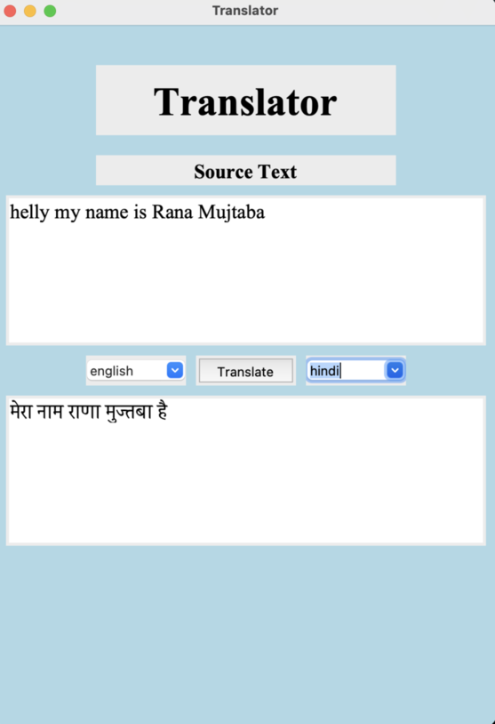

<h2> Translator </h2>
<h3> Python </h3>
<h4> Tkinter, googletrans </h4>

I've created a simple Python application that uses the Tkinter library for GUI and googletrans library for language translation. The purpose of this application is to translate text from one language to another.

You can run the code and a GUI will pop up. In the GUI, you'll find a section where you can type in the text you want to translate. After selecting the languages, you can click on the "Translate" button, and the translated text will appear in the "Destination Text" section.
To run this code, you will need to download the code files and enter the directory and then:
 ```
 pip install googletrans==3.1.0a0
 python google_translate.py
 ```

